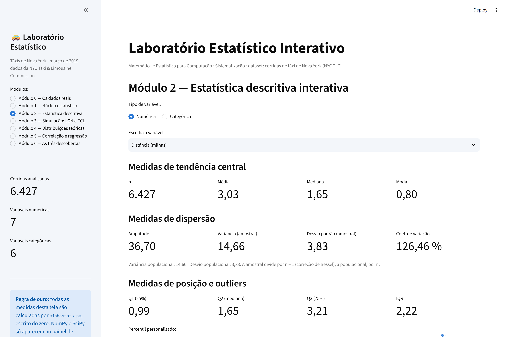
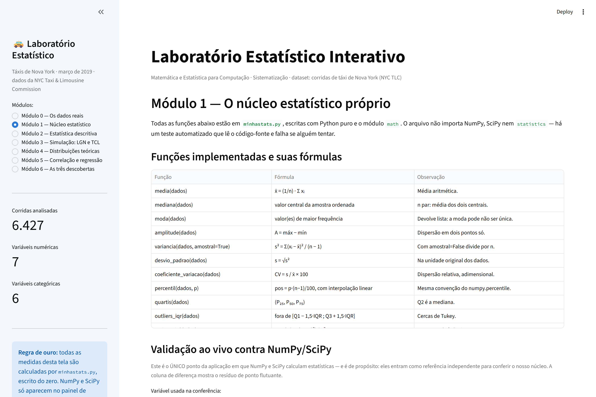
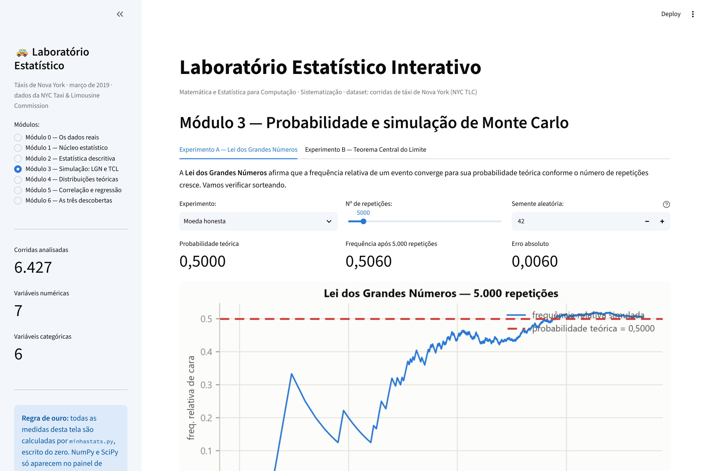
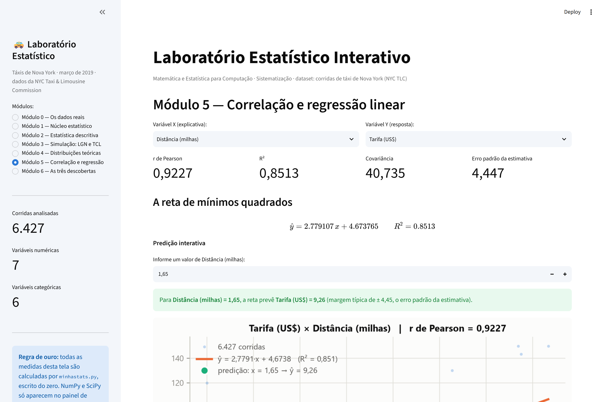
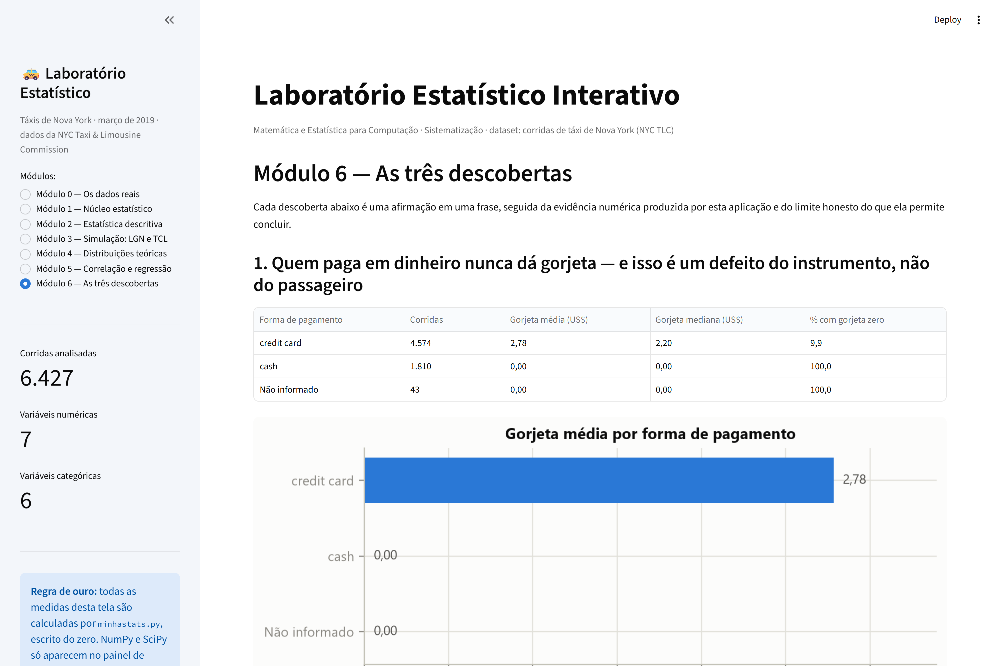

# 🚕 Laboratório Estatístico Interativo

Aplicação web que calcula estatística **do zero** — sem usar as funções
prontas do NumPy, do SciPy ou do `statistics` — sobre 6.427 corridas reais
de táxi da cidade de Nova York.

**Disciplina:** Matemática e Estatística para Computação
**Atividade:** Sistematização — Laboratório Estatístico Interativo
**Professor:** Romes Heriberto

## Integrantes

| Nome completo | Matrícula |
|---|---|
| João Gabriel Amaral de Sales | 72650411 |

> Estes dados também ficam em [`identificacao.py`](identificacao.py), que é
> de onde o gerador do PDF os lê.

---

## De onde vêm os dados

Os registros são das corridas de táxi de Nova York, coletados e publicados
como dado aberto pela **New York City Taxi & Limousine Commission (TLC)**,
a autarquia municipal que regula o serviço de táxi da cidade.

| | |
|---|---|
| **Fonte original (órgão)** | https://www.nyc.gov/site/tlc/about/tlc-trip-record-data.page |
| **Arquivo CSV efetivamente baixado** | https://raw.githubusercontent.com/mwaskom/seaborn-data/master/taxis.csv |
| **Cópia usada pela aplicação** | [`dados/dataset.csv`](dados/dataset.csv) |
| **Período coberto** | 28/02/2019 a 31/03/2019 |
| **Registros** | 6.433 no arquivo original → 6.427 após o tratamento |

O arquivo baixado é uma amostra consolidada em CSV, distribuída no
repositório público `seaborn-data`. A base primária é a da TLC, que publica
os *TLC Trip Record Data* mês a mês em formato Parquet. Optamos pelo CSV
consolidado por ser diretamente reprodutível: uma única URL, sem cadastro,
sem chave de API e sem etapa de conversão.

### Por que este dataset

Três motivos: (1) atende com folga aos critérios da atividade — 6.433
registros, 6 variáveis numéricas e 6 categóricas; (2) é um serviço que
todo mundo entende, o que permite formular perguntas de verdade em vez de
apenas descrever colunas; (3) tem estrutura estatística rica — variáveis
fortemente assimétricas (ótimas para o Teorema Central do Limite), uma
relação linear quase de livro-texto (distância × tarifa) e armadilhas
reais de medição, que renderam as três descobertas.

### Variáveis

| Coluna | Tipo | Significado |
|---|---|---|
| `distance` | numérica contínua | Distância percorrida, em milhas, medida pelo taxímetro |
| `fare` | numérica contínua | Tarifa do taxímetro, em US$, antes de gorjeta e pedágios |
| `tip` | numérica contínua | Gorjeta registrada, em US$ (ver descoberta 1) |
| `tolls` | numérica contínua | Pedágios repassados ao passageiro, em US$ |
| `total` | numérica contínua | Total pago: tarifa + gorjeta + pedágios + taxas |
| `passengers` | numérica discreta | Número de passageiros informado pelo motorista |
| `duracao_min` | numérica contínua (**derivada**) | Minutos entre embarque e desembarque, calculada por nós |
| `color` | categórica | `yellow` (toda a cidade) ou `green` (fora do centro de Manhattan) |
| `payment` | categórica | `credit card` ou `cash` |
| `pickup_borough` / `dropoff_borough` | categórica | Distrito de embarque / desembarque |
| `pickup_zone` / `dropoff_zone` | categórica | Zona tarifária de embarque / desembarque |

### Tratamento aplicado

1. `pickup` e `dropoff` convertidos para data/hora e usados para derivar
   `duracao_min`.
2. **Removidas 6 corridas** com duração menor ou igual a zero — registros
   fisicamente impossíveis.
3. Ausentes nas colunas categóricas (no máximo 0,7% das linhas) viraram a
   categoria explícita **"Não informado"**, em vez de descartar a corrida:
   as colunas numéricas dessas linhas estão completas e são válidas.
4. **Mantidas com ressalva** 45 corridas com distância zero e 96 com zero
   passageiros — não são impossíveis, são prováveis falhas de registro, e
   constam nas limitações do relatório.

---

## Como rodar

```bash
git clone https://github.com/Joao-G14/Laboratorio-estatistico.git
cd Laboratorio-estatistico

python -m venv .venv
.venv\Scripts\activate          # Windows
# source .venv/bin/activate     # Linux / macOS

pip install -r requirements.txt
streamlit run app.py
```

A aplicação abre em `http://localhost:8501`. O dataset já está versionado
em `dados/`, então não há nenhum download a fazer.

### Os outros comandos do projeto

```bash
pytest -v                          # 104 testes: núcleo + interface
python verificar_regra_de_ouro.py  # auditoria: nada de np.mean na tela
python inspecionar_dataset.py      # checklist de validação do dataset
python gerar_figuras.py            # refaz as figuras do relatório
python gerar_pdf.py                # monta o PDF de entrega
python gerar_prints.py             # recaptura os prints (requer playwright)
```

---

## A regra de ouro, e como ela é garantida

> NumPy e Pandas servem para **carregar/manipular** dados e para
> **validar** resultados. Toda medida estatística exibida ao usuário vem
> das funções implementadas pela equipe.

Isto não é só uma promessa no README — é verificado de três formas:

1. **`minhastats.py` não importa** NumPy, SciPy, `statistics` nem Pandas.
   Só Python puro e o módulo `math` (`sqrt`, `exp`, `log`, `pi`, `lgamma`).
2. **Um teste lê o próprio código-fonte** (`test_minhastats.py::test_regra_de_ouro_o_nucleo_nao_importa_biblioteca_estatistica`)
   e quebra se alguém tentar importar uma dessas bibliotecas no núcleo.
3. **`verificar_regra_de_ouro.py`** faz auditoria estática de `app.py` e
   `graficos.py`, procurando chamadas como `np.mean`, `.describe()` ou
   `stats.pearsonr` fora do painel de validação do Módulo 1 — que é a
   única exceção, delimitada no código por marcadores explícitos e
   declarada na própria tela.

A fronteira física é a linha `preparacao.valores(df, coluna)`, que devolve
uma **lista Python pura**. Do outro lado dela, nenhum objeto do Pandas
participa de conta nenhuma.

---

## Estrutura do projeto

```
Laboratorio-estatistico/
├── minhastats.py             # NÚCLEO: as funções estatísticas, Python puro
├── app.py                    # INTERFACE: Streamlit, 7 módulos
├── graficos.py               # VISUALIZAÇÃO: só desenha, não calcula
├── preparacao.py             # CARGA: Pandas lê o CSV e trata os ausentes
├── simulacao.py              # Monte Carlo: LGN e TCL
├── identificacao.py          # nome, matrícula e links da entrega
├── test_minhastats.py        # 94 testes do núcleo contra NumPy/SciPy
├── test_app.py               # 10 testes de fumaça da interface
├── verificar_regra_de_ouro.py
├── inspecionar_dataset.py
├── gerar_figuras.py          # figuras + resumo numérico do relatório
├── gerar_prints.py           # capturas de tela da aplicação
├── gerar_pdf.py              # monta o PDF de entrega
├── requirements.txt
├── README.md
├── RELATORIO.md              # o relatório completo
├── dados/
│   └── dataset.csv
└── assets/                   # figuras, prints e resultados.json
```

A separação é funcional, não decorativa: `minhastats.py` calcula e não sabe
que existe uma tela; `graficos.py` desenha e não sabe estatística;
`app.py` orquestra e não faz conta. Por isso `gerar_figuras.py` consegue
produzir as figuras do relatório **com o mesmo código** que a aplicação usa
na tela — não há duas implementações que possam divergir.

---

## Os 7 módulos

| Módulo | O que faz |
|---|---|
| **0 — Dados reais** | Fonte, checagem dos critérios, dicionário de variáveis, decisões de tratamento e prévia |
| **1 — Núcleo estatístico** | Fórmulas implementadas + tabela de validação **ao vivo** contra NumPy/SciPy, com diferença e tolerância |
| **2 — Descritiva interativa** | Tendência central, dispersão, posição, tabela de frequências (Sturges), histograma, boxplot com outliers do IQR, barras/pizza e interpretação textual automática |
| **3 — Simulação** | Lei dos Grandes Números (moeda/dado) e Teorema Central do Limite sobre os nossos dados, com sliders de repetições e tamanho de amostra |
| **4 — Distribuições teóricas** | Normal + Exponencial/Uniforme sobre o histograma em densidade; Poisson para a contagem de passageiros; erro de ajuste medido e discutido |
| **5 — Correlação e regressão** | Dispersão, r de Pearson, mínimos quadrados, R², resíduos, predição interativa com alerta de extrapolação |
| **6 — Descobertas** | As três descobertas, cada uma com evidência e limite honesto, mais as limitações gerais |

## A aplicação funcionando

### Módulo 2 — Estatística descritiva interativa


### Módulo 1 — Validação do núcleo contra NumPy/SciPy


### Módulo 3 — Teorema Central do Limite sobre os dados


### Módulo 5 — Correlação e regressão


### Módulo 6 — As três descobertas


---

## As três descobertas, em uma frase cada

1. **Quem paga em dinheiro nunca dá gorjeta — e o defeito é do
   instrumento, não do passageiro.** 100% das 1.810 corridas em espécie
   registram gorjeta exatamente zero, porque o taxímetro só captura
   gorjeta eletrônica. O zero significa *"não medido"*, não *"não pago"*.
2. **O número de passageiros não explica nada do preço:** r = 0,0078 com
   a tarifa, R² = 0,00006. A tarifa em Nova York é do veículo, não da
   cabeça — os passageiros extras viajam de graça.
3. **Os outliers de preço têm endereço:** 55,8% das 599 corridas marcadas
   como outliers pela regra do IQR começam ou terminam em um aeroporto,
   contra 6,3% no dataset inteiro — concentração 8,8 vezes maior.

O detalhamento, com gráficos e limites, está em
[**RELATORIO.md**](RELATORIO.md).

---

## Vídeo de demonstração

*[PREENCHER: LINK DO VÍDEO]*
