# Relatório — Laboratório Estatístico Interativo

**Disciplina:** Matemática e Estatística para Computação
**Atividade:** Sistematização — Laboratório Estatístico Interativo
**Professor:** Romes Heriberto

| Nome completo | Matrícula |
|---|---|
| João Gabriel Amaral de Sales | 72650411 |

**Repositório:** https://github.com/Joao-G14/Laboratorio-estatistico
**Vídeo (3–5 min):** *[PREENCHER: LINK DO VÍDEO]*

---

## 1. Resumo executivo

Construímos uma biblioteca estatística em Python puro (`minhastats.py`) —
sem NumPy, SciPy ou `statistics` — e uma aplicação Streamlit de sete
módulos que a usa para analisar **6.427 corridas de táxi da cidade de
Nova York**, registradas pela NYC Taxi & Limousine Commission em março de
2019.

As 24 medidas do núcleo foram validadas contra NumPy/SciPy com diferença
máxima de **4,09 × 10⁻¹²** — resíduo de ponto flutuante, não erro de
fórmula. A suíte tem **104 testes automatizados** (94 do núcleo, 10 da
interface), todos passando.

Os dados renderam três descobertas: um **defeito de medição** que invalida
qualquer leitura ingênua sobre gorjetas; uma **correlação ausente** onde a
intuição de todo mundo prevê uma forte; e **outliers com identidade** — os
valores fora da curva não são ruído, são um segmento de mercado.

---

## 2. O conjunto de dados

### 2.1 Fonte

| | |
|---|---|
| **Fonte original (órgão)** | https://www.nyc.gov/site/tlc/about/tlc-trip-record-data.page |
| **Arquivo CSV baixado** | https://raw.githubusercontent.com/mwaskom/seaborn-data/master/taxis.csv |
| **Publicador** | New York City Taxi & Limousine Commission (TLC) |
| **Período** | 28/02/2019 a 31/03/2019 |
| **Licença/uso** | Dado aberto, publicado pelo município de Nova York |

A **TLC** é a autarquia que regula o serviço de táxi de Nova York e
publica, mês a mês, os *TLC Trip Record Data*: um registro por corrida,
gerado pelo próprio taxímetro. Essa é a base primária. O arquivo que
baixamos é uma **amostra consolidada em CSV** distribuída no repositório
público `seaborn-data`, escolhida por ser diretamente reprodutível — uma
URL única, sem cadastro, sem chave de API e sem etapa de conversão de
Parquet. A cópia exata usada pela aplicação está versionada em
`dados/dataset.csv`, de modo que qualquer pessoa que clone o repositório
reproduz os mesmos números.

### 2.2 Por que escolhemos este dataset

Além de atender com folga aos critérios (6.433 registros, 6 variáveis
numéricas e 6 categóricas), o táxi é um serviço que qualquer pessoa
entende — o que permitiu formular perguntas de verdade antes de olhar os
números, em vez de apenas descrever colunas. E a estrutura estatística é
rica: variáveis fortemente assimétricas (material ideal para o Teorema
Central do Limite), uma relação linear quase de livro-texto (distância ×
tarifa, r = 0,92) e armadilhas reais de medição — que acabaram virando a
descoberta mais interessante do trabalho.

### 2.3 Variáveis utilizadas

| Coluna | Tipo | Significado |
|---|---|---|
| `distance` | numérica contínua | Distância percorrida, em milhas, medida pelo taxímetro |
| `fare` | numérica contínua | Tarifa do taxímetro, em US$, antes de gorjeta e pedágios |
| `tip` | numérica contínua | Gorjeta registrada, em US$ |
| `tolls` | numérica contínua | Pedágios repassados ao passageiro, em US$ |
| `total` | numérica contínua | Total pago: tarifa + gorjeta + pedágios + taxas |
| `passengers` | numérica discreta | Número de passageiros informado pelo motorista |
| `duracao_min` | numérica contínua (**derivada**) | Minutos entre embarque e desembarque |
| `color` | categórica nominal | `yellow` (toda a cidade) ou `green` (fora do centro) |
| `payment` | categórica nominal | `credit card` ou `cash` |
| `pickup_borough` | categórica nominal | Distrito de embarque (4 níveis + ausente) |
| `dropoff_borough` | categórica nominal | Distrito de desembarque (5 níveis + ausente) |
| `pickup_zone` | categórica nominal | Zona tarifária de embarque (194 níveis) |
| `dropoff_zone` | categórica nominal | Zona tarifária de desembarque (203 níveis) |

### 2.4 Decisões de tratamento

O tratamento inteiro está em `preparacao.py`, em uma função só, e é
reexecutado toda vez que a aplicação sobe. Quatro decisões:

1. **Conversão de data/hora e coluna derivada.** `pickup` e `dropoff`
   viraram *datetime*, e deles derivamos `duracao_min`. É a única coluna
   que criamos.
2. **Remoção de 6 corridas com duração ≤ 0.** Uma corrida que termina
   antes de começar é fisicamente impossível: é erro de taxímetro, não
   dado. Restaram **6.427 registros** dos 6.433 originais (0,09%
   descartado).
3. **Ausentes categóricos viraram categoria.** As colunas `payment` (43
   linhas), `pickup_zone`/`pickup_borough` (22) e
   `dropoff_zone`/`dropoff_borough` (39) tinham ausentes — no máximo 0,7%
   das linhas. Em vez de descartar a corrida inteira, preenchemos com a
   categoria explícita **"Não informado"**. O motivo é direto: as colunas
   numéricas dessas corridas estão completas e são válidas; jogá-las fora
   perderia informação boa por causa de um campo ruim. E, como a categoria
   é explícita, ela aparece nas tabelas de frequência em vez de sumir.
4. **Mantidas com ressalva: 45 corridas com distância zero e 96 com zero
   passageiros.** Não são impossíveis — provavelmente o motorista não
   digitou, ou a corrida foi curta demais para o odômetro registrar. Como
   não temos como distinguir "erro" de "valor real raro", mantivemos e
   registramos nas limitações (seção 8).

---

## 3. O núcleo estatístico: fórmulas implementadas

Todas as funções abaixo estão em `minhastats.py`, escritas com Python puro
e o módulo `math` (apenas `sqrt`, `exp`, `log`, `log10`, `pi`, `lgamma` e
`ceil` — funções matemáticas elementares, não estatísticas).

### 3.1 Tendência central

$$\bar{x} = \frac{1}{n}\sum_{i=1}^{n} x_i$$

**Mediana:** ordena-se a amostra; com $n$ ímpar toma-se o elemento
central, com $n$ par a média dos dois centrais.

**Moda:** valor(es) de maior frequência. Devolvemos uma **lista**, porque
a moda pode não ser única (bimodal) ou não existir (amodal) — decisão
documentada no código.

### 3.2 Dispersão

$$s^2 = \frac{\sum_{i=1}^{n}(x_i - \bar{x})^2}{n-1} \qquad\text{(amostral)}
\qquad\qquad
\sigma^2 = \frac{\sum_{i=1}^{n}(x_i - \bar{x})^2}{n} \qquad\text{(populacional)}$$

$$s = \sqrt{s^2} \qquad\qquad A = x_{\max} - x_{\min} \qquad\qquad
CV = \frac{s}{\bar{x}} \times 100$$

A correção de Bessel ($n-1$) existe porque $\bar{x}$ foi estimada dos
próprios dados: os desvios em torno dela já são, por construção, os
menores possíveis. Dividir por $n$ subestimaria a dispersão da população.
No nosso dataset a diferença entre as duas é pequena mas real —
variância do total: 190,4867 (amostral) contra 190,4571 (populacional).

### 3.3 Posição

$$\text{posição} = \frac{p \cdot (n-1)}{100}
\qquad\qquad
P_p = x_{[k]} + f \cdot \left(x_{[k+1]} - x_{[k]}\right)$$

onde $k$ é a parte inteira da posição e $f$ a fracionária. Existem pelo
menos nove convenções de percentil; adotamos a **interpolação linear**, a
mesma do método padrão do `numpy.percentile`, para que a validação seja
direta e verificável. Daí saem os quartis ($P_{25}, P_{50}, P_{75}$) e:

$$IQR = Q_3 - Q_1 \qquad\qquad
\text{outlier se } x < Q_1 - 1{,}5\,IQR \ \text{ ou } \ x > Q_3 + 1{,}5\,IQR$$

### 3.4 Associação

$$\text{cov}(x,y) = \frac{\sum_{i=1}^{n}(x_i - \bar{x})(y_i - \bar{y})}{n-1}
\qquad\qquad
r = \frac{\text{cov}(x,y)}{s_x \cdot s_y}$$

### 3.5 Forma

$$g_1 = \frac{\frac{1}{n}\sum_{i=1}^{n}(x_i - \bar{x})^3}{\sigma^3}
\qquad\qquad
k = \lceil 1 + 3{,}322 \cdot \log_{10}(n) \rceil \ \text{(Sturges)}$$

Também implementamos o **segundo coeficiente de assimetria de Pearson**,
que é a distância média−mediana em forma padronizada:

$$Sk = \frac{3(\bar{x} - \tilde{x})}{s}$$

#### A regra da interpretação automática — e por que trocamos a primeira

A **interpretação textual automática** classifica a forma pelo módulo de
$g_1$, com os cortes usuais: $|g_1| < 0{,}5$ aproximadamente simétrica;
$0{,}5 \le |g_1| < 1$ assimetria moderada; $|g_1| \ge 1$ assimetria forte.
O sinal de $g_1$ dá o lado da cauda.

Nossa **primeira versão** usava a regra mais intuitiva, sugerida no guia:
"se média − mediana passar de meio desvio padrão, é assimétrica". Ao
rodá-la sobre o dataset descobrimos que ela **classificava as sete
variáveis numéricas como simétricas** — inclusive os pedágios, com
$g_1 = 5{,}07$. O motivo é uma armadilha bonita: em distribuição de cauda
pesada, a própria cauda **infla o desvio padrão**, de modo que "meio
desvio" vira um limiar enorme e nada consegue ultrapassá-lo. A régua
cresce junto com o que ela deveria medir.

| Variável | média − mediana | 0,5·s (limiar da regra antiga) | Veredito antigo | $g_1$ | Veredito atual |
|---|---|---|---|---|---|
| Distância | 1,377 | 1,914 | simétrica | 3,007 | fortemente assimétrica à direita |
| Tarifa | 3,587 | 5,766 | simétrica | 3,217 | fortemente assimétrica à direita |
| Total | 4,359 | 6,901 | simétrica | 3,096 | fortemente assimétrica à direita |
| Pedágios | 0,326 | 0,708 | simétrica | 5,071 | fortemente assimétrica à direita |

Trocamos o critério por $g_1$, que é invariante de escala e não depende de
comparar duas medidas com uma terceira contaminada. O texto continua
**reportando** média × mediana, que é a leitura intuitiva para quem lê a
tela, mas **quem decide** é $g_1$.

### 3.6 Regressão linear simples

$$b_1 = \frac{\sum(x_i - \bar{x})(y_i - \bar{y})}{\sum(x_i - \bar{x})^2}
= \frac{\text{cov}(x,y)}{\text{var}(x)}
\qquad\qquad
b_0 = \bar{y} - b_1\bar{x}$$

$$R^2 = 1 - \frac{SQ_{res}}{SQ_{tot}}
= 1 - \frac{\sum(y_i - \hat{y}_i)^2}{\sum(y_i - \bar{y})^2}
\qquad\qquad
s_e = \sqrt{\frac{\sum(y_i - \hat{y}_i)^2}{n-2}}$$

### 3.7 Distribuições teóricas

$$f_{\mathcal{N}}(x) = \frac{1}{\sigma\sqrt{2\pi}}\,
e^{-\frac{1}{2}\left(\frac{x-\mu}{\sigma}\right)^2}
\qquad\qquad
f_{\text{Exp}}(x) = \lambda e^{-\lambda x},\ x \ge 0$$

$$P_{\text{Poisson}}(X=k) = \frac{e^{-\lambda}\lambda^k}{k!}
\qquad\qquad
P_{\text{Bin}}(X=k) = \binom{n}{k}p^k(1-p)^{n-k}
\qquad\qquad
f_{\mathcal{U}}(x) = \frac{1}{b-a}$$

Poisson e Binomial são calculadas em **escala logarítmica**, com
`math.lgamma` no lugar do fatorial: $\log P = -\lambda + k\log\lambda -
\log\Gamma(k+1)$. Com o fatorial direto, $k$ grande estoura o float; em
log, não.

---

## 4. Validação contra NumPy/SciPy

Cada função foi comparada com uma referência independente, sobre as
variáveis reais do dataset. A tabela abaixo é a saída de
`python gerar_tabela_validacao.py`.

| Função (minhastats.py) | Nosso valor | Referência (NumPy/SciPy) | Diferença absoluta | Tolerância |
|---|---|---|---|---|
| `media(total)` | 18,5187288004 | 18,5187288004 | 9,95e-13 | 1e-9 |
| `mediana(total)` | 14,1600000000 | 14,1600000000 | 0,00e+00 | 1e-9 |
| `amplitude(total)` | 173,5200000000 | 173,5200000000 | 0,00e+00 | 1e-9 |
| `variancia(total, amostral=True)` | 190,4867312970 | 190,4867312970 | 4,26e-13 | 1e-9 |
| `variancia(total, amostral=False)` | 190,4570927827 | 190,4570927827 | 4,55e-13 | 1e-9 |
| `desvio_padrao(total, amostral=True)` | 13,8016930591 | 13,8016930591 | 1,60e-14 | 1e-9 |
| `desvio_padrao(total, amostral=False)` | 13,8006192898 | 13,8006192898 | 1,60e-14 | 1e-9 |
| `coeficiente_variacao(total)` | 74,5282962338 | 74,5282962338 | 4,09e-12 | 1e-9 |
| `percentil(total, 25)` | 10,8000000000 | 10,8000000000 | 0,00e+00 | 1e-6 |
| `percentil(total, 50)` | 14,1600000000 | 14,1600000000 | 0,00e+00 | 1e-6 |
| `percentil(total, 75)` | 20,3000000000 | 20,3000000000 | 0,00e+00 | 1e-6 |
| `percentil(total, 90)` | 33,3600000000 | 33,3600000000 | 0,00e+00 | 1e-6 |
| `assimetria(total)` | 3,0961675727 | 3,0961675727 | 1,87e-13 | 1e-9 |
| `covariancia(distancia, tarifa)` | 40,7353051252 | 40,7353051252 | 9,24e-14 | 1e-9 |
| `correlacao(distancia, tarifa)` | 0,9226590255 | 0,9226590255 | 4,77e-15 | 1e-9 |
| `correlacao(passageiros, tarifa)` | 0,0077994814 | 0,0077994814 | 2,78e-16 | 1e-9 |
| `regressao_linear -> b1` | 2,7791067492 | 2,7791067492 | 6,22e-15 | 1e-9 |
| `regressao_linear -> b0` | 4,6737652874 | 4,6737652874 | 2,31e-14 | 1e-9 |
| `regressao_linear -> R²` | 0,8512996773 | 0,8512996773 | 9,99e-16 | 1e-9 |
| `erro_padrao_estimativa(dist, tarifa)` | 4,4471995495 | 4,4471995495 | 1,15e-14 | 1e-9 |
| `densidade_normal(20; media; desvio)` | 0,0287393169 | 0,0287393169 | 0,00e+00 | 1e-10 |
| `densidade_exponencial(5; 1/media)` | 0,0633375026 | 0,0633375026 | 1,39e-17 | 1e-10 |
| `probabilidade_poisson(1; lambda)` | 0,3301753528 | 0,3301753528 | 0,00e+00 | 1e-10 |
| `probabilidade_binomial(3; 10; 0,3)` | 0,2668279320 | 0,2668279320 | 3,89e-16 | 1e-10 |

**Maior diferença absoluta observada: 4,09 × 10⁻¹².**

### Sobre as tolerâncias

Somas de ponto flutuante feitas em ordens diferentes divergem nas últimas
casas decimais — isso é esperado, não é bug. As tolerâncias foram
escolhidas assim:

- **1e-9** para as medidas construídas por somatório. É folgado o
  bastante para o ruído de arredondamento e apertado o bastante para
  pegar erro real de fórmula: trocar $n-1$ por $n$, por exemplo, produz
  erro da ordem de $1/n \approx 1{,}6 \times 10^{-4}$ — cem milhões de
  vezes maior que a tolerância.
- **1e-6** para percentis, que envolvem multiplicação e divisão de
  índices, com folga extra por haver várias convenções possíveis.
- **1e-10** para as densidades teóricas, que são avaliações diretas de
  `exp`/`log` e saem praticamente exatas.

### A suíte de testes

`pytest -v` roda **104 testes**:

- **94 em `test_minhastats.py`** — cada função contra sua referência, mais
  os casos de borda: lista vazia, $n = 1$ na variância amostral, variável
  constante na correlação, vetores de tamanhos diferentes na covariância,
  $p$ fora de [0, 100] no percentil, e as identidades de consistência
  ($R^2 = r^2$ na regressão simples; soma das probabilidades da Binomial
  igual a 1; área do histograma em densidade igual a 1).
- **10 em `test_app.py`** — o `AppTest` do Streamlit sobe a aplicação em
  memória, navega pelos sete módulos e verifica que nenhum levanta
  exceção, inclusive ao mexer nos controles.

Um desses testes merece destaque: `test_regra_de_ouro_o_nucleo_nao_importa_biblioteca_estatistica`
**lê o código-fonte de `minhastats.py`** e falha se encontrar
`import numpy`, `import scipy`, `import statistics` ou `import pandas`. A
regra de ouro deixou de ser uma promessa e virou um teste.

> **Um bug real que os testes pegaram.** A primeira versão de
> `tabela_frequencias_continua` calculava o limite superior da última
> classe como `mínimo + k × largura`. Por acúmulo de erro de ponto
> flutuante, esse valor ficava uma fração abaixo do máximo observado, e
> **o maior valor do conjunto caía fora da tabela** — 499 elementos
> contados em vez de 500. O teste que exigia
> `soma das frequências == n` quebrou, e a correção foi fixar a última
> fronteira no próprio máximo. Sem o teste, o histograma estaria errado
> em um elemento e ninguém perceberia.

---

## 5. Os módulos, um a um

### Módulo 0 — Os dados reais

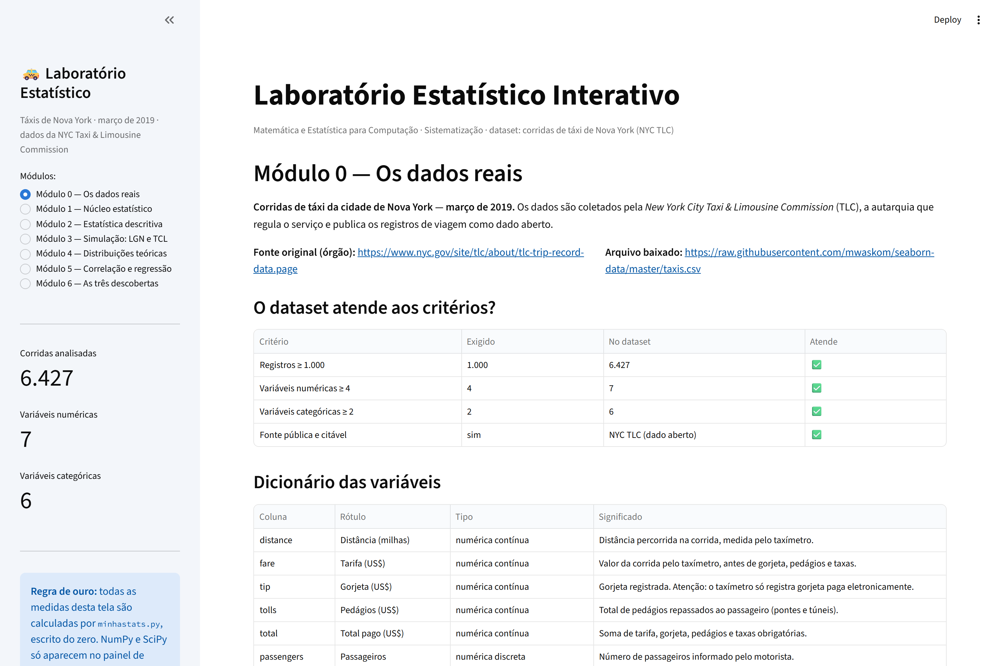

A tela abre com a fonte, a verificação automática dos critérios da
atividade (calculada a partir do próprio arquivo, não digitada à mão), o
dicionário das 13 variáveis, o relatório de tratamento e uma prévia. Todo
número aqui é recalculado a cada execução: se alguém trocar o CSV, a tela
avisa se o novo arquivo ainda atende aos critérios.

### Módulo 1 — Núcleo estatístico


Lista as funções com suas fórmulas e monta, **ao vivo**, a tabela de
validação da seção 4 para a variável que o usuário escolher. É o único
ponto da aplicação em que NumPy e SciPy calculam estatística — e está
delimitado no código por marcadores (`# regra-de-ouro:
inicio-excecao-validacao`) que o auditor `verificar_regra_de_ouro.py` lê
para liberar exatamente aquele trecho e mais nenhum.

### Módulo 2 — Estatística descritiva interativa


O usuário escolhe qualquer variável e recebe as três famílias de medidas,
um percentil personalizado por slider, a tabela de frequências em classes
de Sturges, histograma, boxplot com os outliers do IQR destacados e a
interpretação textual automática.

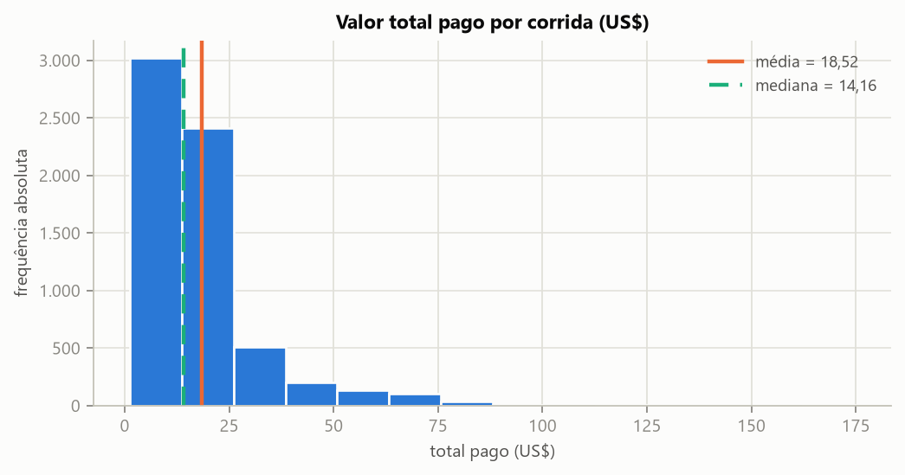

**Leitura.** O valor total pago tem média US$ 18,52 e mediana US$ 14,16, e
o coeficiente de assimetria vale $g_1 = 3{,}10$ — cauda longa à direita,
exatamente o que o histograma mostra. A média está sendo puxada por uma
minoria de corridas caras, então **para descrever a corrida típica a
mediana é a medida honesta**. A aplicação escreve isso sozinha: *"Distribuição
fortemente ASSIMÉTRICA à DIREITA (g₁ = 3,10; coeficiente de Pearson
Sk = 0,95). A média (18,52) está acima da mediana (14,16): uma minoria de
valores altos puxa a média para cima, então a MEDIANA descreve melhor o
caso típico."*

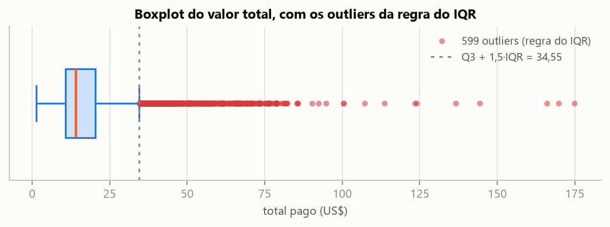

**Leitura.** Com $Q_1 = 10{,}80$ e $Q_3 = 20{,}30$, o IQR é 9,50 e a cerca
superior cai em US$ 34,55. Acima dela há **599 corridas (9,32%)**. São
elas que a descoberta 3 identifica.

Resumo das sete variáveis numéricas (todas calculadas por `minhastats.py`):

| Variável | Média | Mediana | Desvio (amostral) | CV | $Q_1$ | $Q_3$ | $g_1$ | Outliers (IQR) |
|---|---|---|---|---|---|---|---|---|
| Distância (mi) | 3,027 | 1,650 | 3,829 | 126,5% | 0,990 | 3,210 | 3,007 | 736 (11,45%) |
| Tarifa (US$) | 13,087 | 9,500 | 11,532 | 88,1% | 6,500 | 15,000 | 3,217 | 591 (9,20%) |
| Gorjeta (US$) | 1,981 | 1,700 | 2,449 | 123,6% | 0,000 | 2,800 | 2,664 | 280 (4,36%) |
| Pedágios (US$) | 0,326 | 0,000 | 1,416 | 434,9% | 0,000 | 0,000 | 5,071 | 350 (5,45%) |
| Total (US$) | 18,519 | 14,160 | 13,802 | 74,5% | 10,800 | 20,300 | 3,096 | 599 (9,32%) |
| Passageiros | 1,540 | 1,000 | 1,204 | 78,2% | 1,000 | 2,000 | 2,357 | 540 (8,40%) |
| Duração (min) | 14,363 | 10,917 | 11,641 | 81,1% | 6,517 | 18,533 | 2,004 | 358 (5,57%) |

**Duas coisas a notar nesta tabela.** Primeiro, **todas as sete variáveis
têm $g_1 > 0$** — não há uma única variável simétrica no dataset, o que
faz sentido: preço, tempo e distância são grandezas com piso em zero e
sem teto. Segundo, **o CV dos pedágios é 434,9%**, absurdamente alto, e o
motivo é que a variável é quase toda zero: 75% das corridas não pagam
pedágio nenhum, então o $IQR$ é **zero** e a regra de Tukey degenera —
ela passa a marcar como "outlier" qualquer corrida que simplesmente tenha
pago pedágio. A aplicação detecta esse caso e exibe um aviso em vez de
apresentar o número como se fosse anomalia. **É um limite do método, não
um achado sobre os dados.**

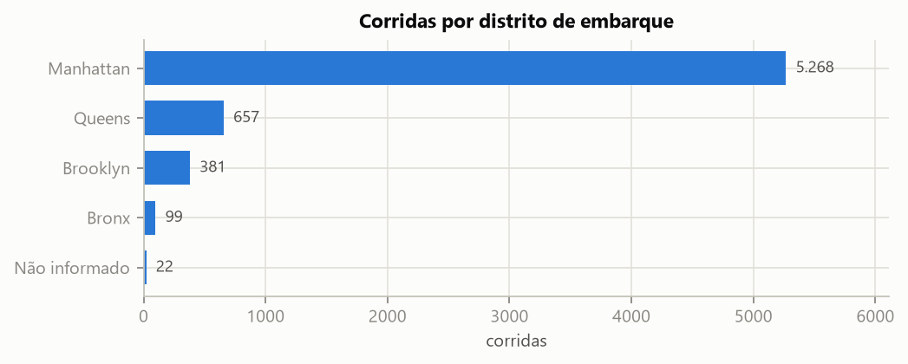

Para variáveis categóricas, a tela mostra tabela de frequências com
acumuladas e barras (ou pizza, quando há até cinco categorias — acima
disso a pizza é omitida com uma justificativa em tela). Manhattan
concentra **81,97%** dos embarques; Queens tem 10,22%, Brooklyn 5,93% e
Bronx 1,54%.

### Módulo 3 — Simulação de Monte Carlo


**Experimento A — Lei dos Grandes Números.**

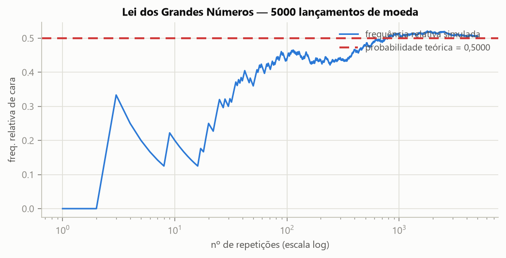

Com 5.000 lançamentos de moeda honesta (semente 42), a frequência
relativa de cara foi:

| Após n lançamentos | 10 | 100 | 1.000 | 5.000 |
|---|---|---|---|---|
| Frequência relativa | 0,2000 | 0,4400 | 0,5140 | 0,5060 |

Contra a probabilidade teórica de 0,5000 — erro final de **0,0060**. O
eixo x está em escala logarítmica de propósito: a convergência acontece
por ordens de grandeza, e em escala linear os primeiros 50 lançamentos,
justamente onde está a instabilidade interessante, ficariam espremidos
contra a origem. **A leitura importante é que a convergência não é uma
descida suave do erro: é uma oscilação que vai perdendo amplitude.**
Mudando a semente, cada simulação zigue-zagueia diferente no começo — e
todas terminam no mesmo lugar.

**Experimento B — Teorema Central do Limite.**

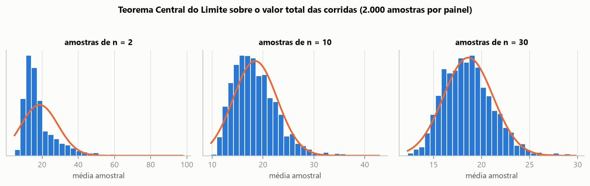

Sorteamos 2.000 amostras do valor total pago, para três tamanhos de
amostra, e histogramamos as médias (cada média calculada por
`ms.media`). A população é fortemente assimétrica ($g_1 = 3{,}096$,
$\mu = 18{,}52$, $\sigma = 13{,}80$):

| n | Média das médias | Desvio observado | $\sigma/\sqrt{n}$ previsto | $g_1$ das médias |
|---|---|---|---|---|
| 2 | 18,585 | 10,188 | 9,759 | 2,549 |
| 10 | 18,446 | 4,311 | 4,364 | 1,003 |
| 30 | 18,616 | 2,576 | 2,520 | 0,566 |

**Três leituras.** (1) A média das médias fica colada em $\mu = 18{,}519$
para qualquer $n$ — a média amostral é um estimador **não viesado**. (2) O
desvio observado acompanha $\sigma/\sqrt{n}$ com erro abaixo de 5%:
quadruplicar a amostra corta o erro pela metade. (3) A assimetria das
médias **cai de 2,55 para 0,57** conforme $n$ vai de 2 a 30 — é
literalmente a distribuição virando um sino, partindo de dados que são
tudo menos normais. É por isso que a Normal aparece em todo lugar: não
porque os fenômenos sejam normais, mas porque **médias** de qualquer coisa
tendem a ser.

### Módulo 4 — Distribuições teóricas

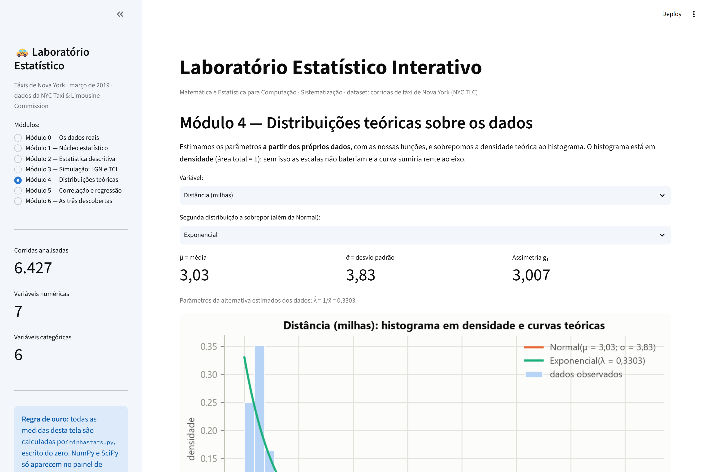

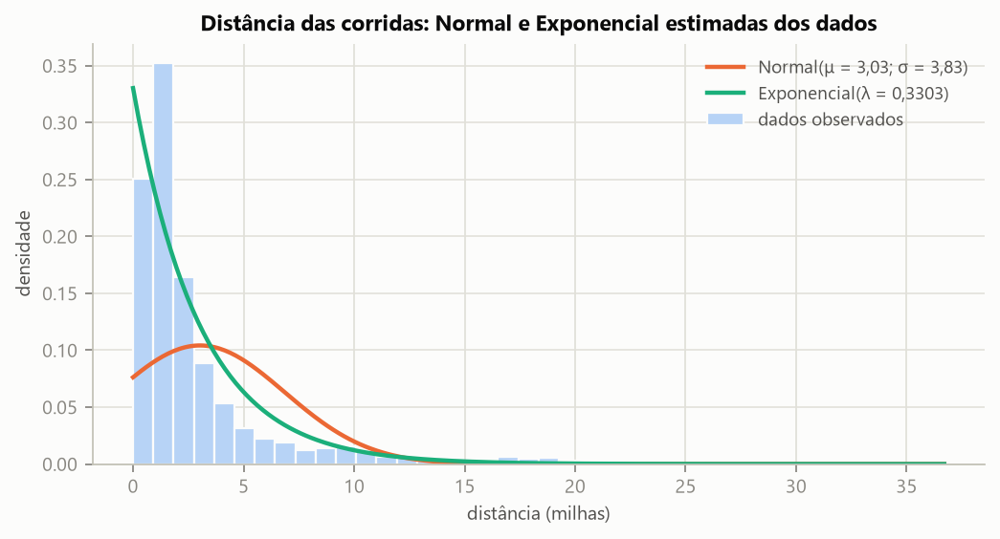

Parâmetros estimados dos próprios dados, com as nossas funções:
$\hat{\mu} = \bar{x} = 3{,}027$, $\hat{\sigma} = s = 3{,}829$ para a
Normal; $\hat{\lambda} = 1/\bar{x} = 0{,}3303$ para a Exponencial. O
histograma está em **densidade** (área = 1) — sem isso as escalas não
bateriam e as curvas sumiriam rente ao eixo.

Medimos a qualidade do ajuste pelo erro absoluto médio entre a densidade
observada de cada classe e a densidade teórica no seu ponto médio:

| Distribuição | Erro médio absoluto | Maior erro em uma classe |
|---|---|---|
| Normal(3,03; 3,83) | 0,020316 | 0,256939 |
| Exponencial(λ = 0,3303) | **0,008986** | **0,142236** |

**A Normal ajusta mal, e o motivo é identificável.** A distância tem
$g_1 = 3{,}007$, longe do zero que a Normal pressupõe. Por ser simétrica,
a curva normal coloca massa de probabilidade **à esquerda de zero** —
região onde a variável nem pode existir, já que não há corrida de
distância negativa — e ao mesmo tempo morre cedo demais na cauda direita,
onde estão as corridas longas de aeroporto. A Exponencial, que já nasce
assimétrica e ancorada em zero, erra **menos da metade**: ela descreve
bem o decaimento geral, embora subestime o pico das corridas curtíssimas.
Faz sentido teórico: a Exponencial é a distribuição natural de "distância
até o próximo evento", e uma corrida urbana é aproximadamente isso.

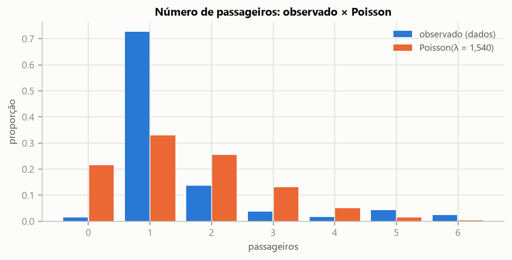

Para a contagem de passageiros, a candidata natural é a **Poisson**, com
$\hat{\lambda} = \bar{x} = 1{,}540$. O ajuste é **ruim, e isso é o
achado**:

| k passageiros | 0 | 1 | 2 | 3 | 4 | 5 | 6 |
|---|---|---|---|---|---|---|---|
| Observado | 1,49% | **72,69%** | 13,63% | 3,78% | 1,71% | 4,31% | 2,38% |
| Poisson(1,54) | 21,44% | 33,02% | 25,42% | 13,05% | 5,02% | 1,55% | 0,40% |

A Poisson prevê 21% de corridas com zero passageiros (observamos 1,5%) e
33% com um passageiro (observamos 73%). **Nenhum valor de $\lambda$
consertaria isso** — o problema é conceitual. A Poisson descreve eventos
raros e independentes ao longo de um intervalo; o número de passageiros de
um táxi não é isso. É o tamanho de um grupo social, com um pico enorme em
1 (quem anda sozinho), um teto físico em 6 lugares e um segundo pico em 5
(grupos que ocupam o carro inteiro). **Um modelo que não corresponde ao
fenômeno não se salva com estimativa melhor de parâmetro.**

### Módulo 5 — Correlação e regressão linear


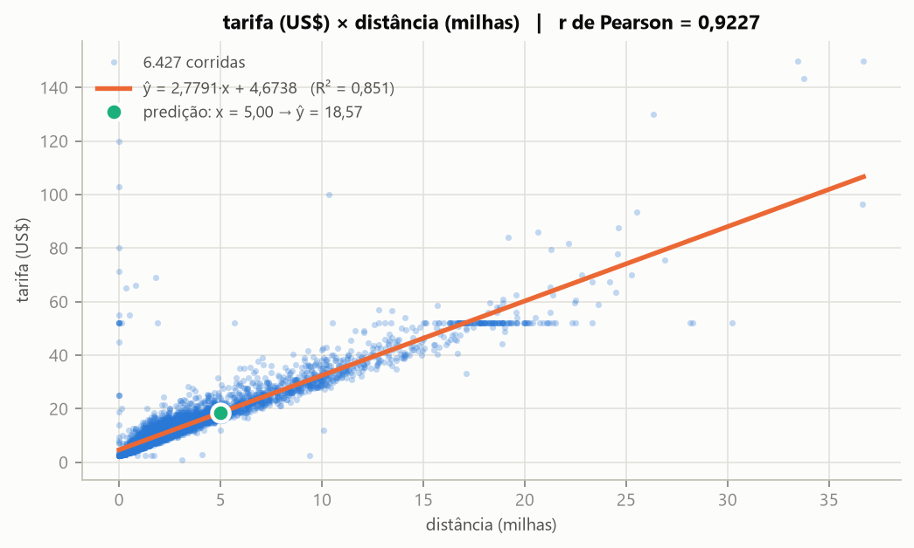

| Medida | Valor |
|---|---|
| Covariância | 40,7353 |
| **r de Pearson** | **0,9227** (associação quase perfeita e positiva) |
| **Reta** | **ŷ = 2,7791·x + 4,6738** |
| **R²** | **0,8513** |
| Erro padrão da estimativa | 4,4472 |
| Faixa observada de x | [0,00 ; 36,70] milhas |

**Interpretação dos coeficientes.** Cada milha a mais está **associada**,
em média, a **US$ 2,78 a mais** de tarifa. O intercepto $b_0 = 4{,}67$ é o
valor previsto para uma corrida de distância zero — e aqui ele tem
significado concreto, porque Nova York cobra uma **bandeirada** mais taxas
fixas antes de o carro andar; US$ 4,67 é uma estimativa plausível desse
piso. O $R^2 = 0{,}8513$ diz que a distância explica **85,13%** da
variação da tarifa; os 14,87% restantes vêm do que este modelo não vê —
tempo parado no trânsito, sobretaxas de horário, tarifas fixas.

Exemplo de predição: para **5 milhas**, a reta prevê **US$ 18,57**, com
margem típica de ± US$ 4,45. A aplicação avisa em vermelho se o usuário
digitar um valor fora de [0 ; 36,70]: extrapolar é chute vestido de
matemática, porque a reta só foi validada dentro do intervalo observado.

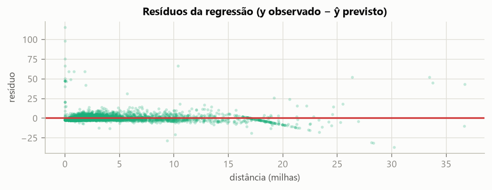

**O que os resíduos denunciam.** Duas coisas. Primeira, o funil que abre
com a distância — corridas longas erram mais, em valor absoluto, do que
corridas curtas (heterocedasticidade). Segunda, e mais interessante: há
uma **faixa horizontal de tarifas idênticas em US$ 52,00** no diagrama de
dispersão. São **131 corridas**, e **87,8% delas tocam um aeroporto**.
Não é erro nem coincidência: é a **tarifa fixa JFK ↔ Manhattan**, uma
regra tarifária da cidade que ignora o taxímetro. Naquela faixa o preço
simplesmente não cresce com a distância, e nenhum ajuste de $b_0$ ou $b_1$
resolve — o que faltaria é uma variável indicadora de "corrida com tarifa
fixa", isto é, outro modelo. **É o tipo de coisa que $R^2$ nenhum revela e
que só aparece quando se olha o gráfico.**

> ⚠️ **Correlação não implica causalidade.** Um exemplo limpo dentro deste
> mesmo dataset: **pedágios e gorjeta** têm correlação positiva
> (r = 0,414). Ninguém dá gorjeta porque pagou pedágio. As duas sobem
> juntas porque acompanham um terceiro fator — corridas longas, de
> aeroporto, que atravessam pontes e túneis e rendem contas altas. A
> variável escondida é a distância; pedágio e gorjeta apenas compartilham
> essa causa comum. Pela mesma lógica, mesmo o r = 0,92 entre distância e
> tarifa é associação: o que *causa* o preço é a regra tarifária da
> cidade, que por acaso usa a distância como insumo.

---

## 6. As três descobertas

### Descoberta 1 — Quem paga em dinheiro nunca dá gorjeta, e o defeito é do instrumento

> **Afirmação.** Todas as 1.810 corridas pagas em dinheiro registram
> gorjeta exatamente zero. Isso não mede generosidade: mede o que o
> taxímetro consegue enxergar.

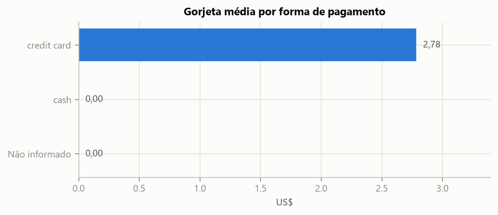

**Evidência.**

| Forma de pagamento | Corridas | Gorjeta média | Gorjeta mediana | % com gorjeta zero |
|---|---|---|---|---|
| `credit card` | 4.574 | US$ 2,78 | US$ 2,20 | 9,9% |
| `cash` | 1.810 | US$ 0,00 | US$ 0,00 | **100,0%** |
| Não informado | 43 | US$ 0,00 | US$ 0,00 | 100,0% |

**Por que isso importa.** A leitura ingênua seria *"quem paga em dinheiro
é mão-fechada"*. Ela está errada, e o dado que a desmonta é o **100,0%**:
não é uma tendência forte, é a totalidade — e comportamento humano não
produz unanimidade. O taxímetro de Nova York só registra a gorjeta quando
ela passa pela maquininha; gorjeta em espécie vai direto para o motorista
e nunca entra no sistema. **O zero aqui significa "não medido", não "não
pago".**

**Limite honesto.** A consequência é que a gorjeta média de US$ 1,98
calculada sobre o dataset inteiro (seção 5) está **subestimada por
construção**: ela divide o total arrecadado em cartão por *todas* as
corridas, inclusive as 1.810 em que a gorjeta existiu mas não foi vista.
Qualquer conclusão sobre gorjeta neste dataset só vale **dentro do
subconjunto pago com cartão** — e mesmo aí, o recorte não é aleatório,
porque quem escolhe pagar com cartão pode ser sistematicamente diferente
de quem paga em espécie. É um erro que só aparece olhando a distribuição;
a média sozinha o esconde.

### Descoberta 2 — O número de passageiros não explica nada do preço

> **Afirmação.** A correlação entre número de passageiros e tarifa é
> r = 0,0078, e a regressão devolve R² = 0,00006. O número de pessoas no
> carro explica **0,006%** da variação do preço.

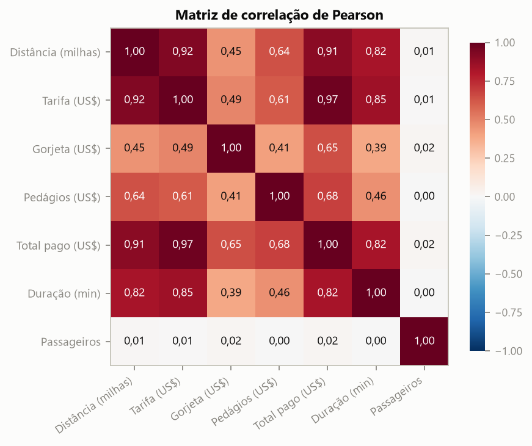

**Evidência.** A linha de `Passageiros` é a única pálida do mapa de calor
inteiro:

| Variável | r com nº de passageiros | r² |
|---|---|---|
| Distância | +0,0091 | 0,000083 |
| Tarifa | +0,0078 | 0,000061 |
| Gorjeta | +0,0208 | 0,000431 |
| Pedágios | −0,0030 | 0,000009 |
| Total pago | +0,0157 | 0,000247 |
| Duração | −0,0049 | 0,000024 |

Para efeito de comparação, na mesma matriz: distância × tarifa = 0,92,
tarifa × total = 0,97, distância × duração = 0,82.

**Por que isso é uma descoberta.** Porque a intuição de quase todo mundo
prevê o contrário. Em ônibus, avião, trem e aplicativo com categoria por
capacidade, mais gente custa mais caro. Em táxi de Nova York, não: a
tarifa é do **veículo**, cobrada por distância percorrida e por tempo
parado, e os passageiros adicionais viajam de graça. O dado não está com
defeito — a intuição é que estava. Como diz o guia da atividade, uma
correlação **ausente** onde todos jurariam que existe costuma ser mais
informativa que uma correlação forte esperada.

**Limite honesto.** O r de Pearson mede associação **linear**. Um r ≈ 0
não prova ausência total de relação: poderia existir um efeito não linear
(por exemplo, só grupos de 5 ou 6 pessoas mudarem algo) que Pearson não
captura. O que torna essa hipótese pouco plausível é a **consistência**: a
ausência se repete contra as seis variáveis numéricas, com sinais
alternando entre positivo e negativo, que é exatamente o padrão de ruído
em torno de zero. Ainda assim, provar ausência de relação exigiria um
teste que não fizemos.

### Descoberta 3 — Os outliers de preço têm endereço: são as corridas de aeroporto

> **Afirmação.** 55,8% das corridas marcadas como outliers de preço pela
> regra do IQR começam ou terminam em um aeroporto, contra 6,3% no
> dataset inteiro — concentração **8,8 vezes maior**. Os valores fora da
> curva não são ruído: são um segmento de mercado.

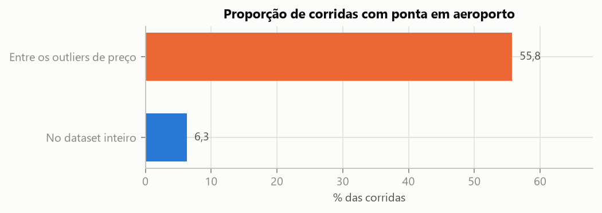

**Evidência.** A regra de Tukey sobre o valor total ($Q_1 = 10{,}80$,
$Q_3 = 20{,}30$, cerca superior em US$ 34,55) marca **599 corridas
(9,32%)** como outliers.

| Grupo | n | Total mediano | % com pedágio | % tocando aeroporto |
|---|---|---|---|---|
| Outliers (IQR) | 599 | US$ 50,06 | **55,3%** | **55,8%** |
| Demais corridas | 5.828 | US$ 13,55 | 0,3% | 6,3% |

O pedágio confirma por um caminho independente: ele aparece em 55,3% dos
outliers e em apenas 0,3% das demais corridas — são viagens que
atravessam pontes e túneis para sair da ilha de Manhattan. E a
confirmação mais visual está no Módulo 5: a faixa horizontal de **131
corridas com tarifa idêntica de US$ 52,00** (87,8% tocando aeroporto) é a
tarifa fixa JFK ↔ Manhattan — uma regra tarifária da cidade **visível a
olho nu no diagrama de dispersão**.

**Por que importa.** Esses 599 pontos não são erro de medição, e
descartá-los como "ruído" — o reflexo automático de quem vê a palavra
*outlier* — apagaria um segmento real e economicamente relevante do
serviço. A conclusão prática é mais forte do que "há outliers":
**não existe uma distribuição de preço de táxi em Nova York, existem
duas populações misturadas.** O trajeto urbano curto, com mediana de
US$ 13,55, e a corrida de aeroporto, com mediana de US$ 50,06 — quase
quatro vezes mais. Uma média calculada sobre a mistura não descreve nem
uma nem outra.

**Limite honesto.** Três ressalvas. (1) "Aeroporto" aqui é a zona de
embarque ou desembarque **registrada**; corridas de/para Newark aparecem
pouco por ser um aeroporto fora da cidade. (2) "Outlier pela regra do IQR"
é uma **convenção** (o fator 1,5), não uma verdade da natureza — com
3,0·IQR o recorte seria outro e os percentuais mudariam. (3) Os 44,2% de
outliers que **não** tocam aeroporto continuam sem explicação nesta
análise; provavelmente são corridas longas entre distritos, mas não
testamos.

---

## 7. Reprodutibilidade

```bash
git clone https://github.com/Joao-G14/Laboratorio-estatistico.git
cd Laboratorio-estatistico
python -m venv .venv && .venv\Scripts\activate
pip install -r requirements.txt

pytest -v                          # 104 testes
python verificar_regra_de_ouro.py  # auditoria da regra de ouro
python gerar_figuras.py            # refaz todas as figuras deste relatório
streamlit run app.py               # a aplicação
```

O dataset está versionado em `dados/dataset.csv`, e todas as simulações
usam **semente fixa** (42 nas figuras do relatório), então os números
acima são reproduzíveis exatamente. As figuras deste relatório e os
gráficos da aplicação saem do **mesmo módulo** `graficos.py`, alimentado
pelo **mesmo** `minhastats.py`: não existem duas implementações que possam
divergir.

---

## 8. Limitações — o que esta análise **não** permite concluir

1. **Não vale para outros períodos.** A amostra cobre 28/02/2019 a
   31/03/2019: um mês de fim de inverno, antes da pandemia. Sazonalidade,
   feriados, clima e a mudança de comportamento urbano pós-2020 estão
   fora do alcance destes dados. Nada aqui descreve o táxi de Nova York
   "em geral" — descreve março de 2019.

2. **Não é a população de corridas.** São 6.427 corridas de um universo de
   milhões por mês. É uma amostra pública e **não sabemos qual processo a
   gerou** — se foi sorteio aleatório simples, se houve filtro por região
   ou por tipo de corrida. Sem isso, nenhuma extrapolação formal para a
   cidade inteira é defensável, e nenhum intervalo de confiança que
   calculássemos teria a cobertura que anuncia.

3. **Nada aqui é causal.** Todo o trabalho é de associação. A regressão
   prevê bem a tarifa a partir da distância, mas não prova que a distância
   *causa* o preço — o que causa o preço é a regra tarifária municipal.
   O exemplo de pedágio × gorjeta (r = 0,414) mostra como duas variáveis
   sobem juntas sem qualquer relação direta.

4. **O zero da gorjeta é ambíguo.** Conforme a descoberta 1, "gorjeta = 0"
   pode significar "não pagou" ou "pagou em espécie e o sistema não viu".
   Isso contamina toda e qualquer conclusão sobre generosidade do
   passageiro, e subestima por construção as médias de gorjeta e de valor
   total.

5. **Mantivemos dados provavelmente defeituosos.** As 45 corridas com
   distância zero e as 96 com zero passageiros foram preservadas por não
   serem fisicamente impossíveis, mas quase certamente são falhas de
   registro. Elas puxam levemente para baixo as medidas dessas duas
   variáveis — o efeito é pequeno (0,7% e 1,5% das linhas), mas existe.

6. **Só testamos relações lineares.** O r de Pearson e a reta de mínimos
   quadrados não enxergam curvas, patamares ou efeitos de limiar. A
   própria tarifa fixa de US$ 52,00 é a prova: é uma estrutura real nos
   dados que o modelo linear não consegue representar.

7. **A regra do IQR tem pressupostos.** Ela assume dispersão no miolo da
   distribuição. Em variáveis infladas de zeros, como `tolls` (75% das
   corridas pagam zero, $IQR = 0$), a regra degenera e classifica como
   "outlier" qualquer valor não nulo. A aplicação sinaliza esse caso, mas
   ele mostra que "outlier" é um resultado de método, não uma propriedade
   intrínseca do dado.

8. **A validação é contra NumPy/SciPy, não contra a verdade.** Se o NumPy
   e a nossa implementação errassem a mesma fórmula da mesma forma, os
   testes passariam. Isso é mitigado pelos testes de propriedade
   (identidades como $R^2 = r^2$, somas de probabilidade iguais a 1, área
   do histograma igual a 1) e pelos casos de borda, mas não é eliminado.
